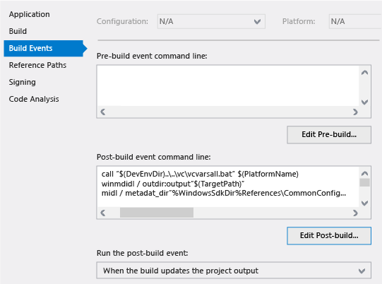

# <a name="raising-events-in-windows-runtime-components"></a>Generación de eventos en componentes de Windows Runtime
> [!NOTE]
> Para obtener información sobre cómo generar eventos en una [C++ / WinRT](../cpp-and-winrt-apis/intro-to-using-cpp-with-winrt.md) componente de Windows en tiempo de ejecución, consulta [crear eventos en C++ / WinRT](../cpp-and-winrt-apis/author-events.md).

Si tu componente de Windows Runtime genera un evento de un tipo de delegado definido por el usuario en un subproceso en segundo plano (subproceso de trabajo) y deseas que JavaScript pueda recibir el evento, puedes implementarlo o generarlo mediante uno de estos métodos:

-   (Opción 1) Genera el evento a través de [Windows.UI.Core.CoreDispatcher](https://msdn.microsoft.com/library/windows/apps/windows.ui.core.coredispatcher.aspx) para calcular las referencias del evento en el contexto del subproceso de JavaScript. Aunque esta suele ser la mejor opción, en algunos escenarios es posible que no proporcione el rendimiento más rápido.
-   (Opción 2) Usa [Windows.Foundation.EventHandler](https://msdn.microsoft.com/library/windows/apps/br206577.aspx)&lt;Object&gt; pero pierde la información de tipo (pierde la información de tipo de evento). Si no es factible la opción 1 o su rendimiento no es adecuado, esta es una buena segunda opción si la pérdida de información de tipo es aceptable.
-   (Opción 3) Crea tu propio proxy y código auxiliar para el componente. Esta opción es la más difícil de implementar, pero conserva la información de tipo y podría proporcionar un mejor rendimiento en comparación con la opción 1 en escenarios exigentes.

Si solo se genera un evento en un subproceso en segundo plano sin usar una de estas opciones, un cliente de JavaScript no recibirá el evento.

## <a name="background"></a>En segundo plano

Todos los componentes y aplicaciones de Windows Runtime son fundamentalmente objetos COM, independientemente del lenguaje que se usa para crearlos. En la API de Windows, la mayoría de los componentes son objetos COM ágiles que se pueden comunicar igual de bien con los objetos en el subproceso en segundo plano y en el subproceso de IU. Si no se puede realizar un objeto COM ágil, se requerirán objetos auxiliares conocidos como proxies y códigos auxiliares para comunicarse con otros objetos COM a través de los límites del subproceso de IU y el subproceso en segundo plano. (En términos COM, esto se conoce como una comunicación entre subprocesamientos controlados).

La mayoría de los objetos de la API de Windows son ágiles o tienen proxies y códigos auxiliares integrados. Sin embargo, no se pueden crear proxies ni códigos auxiliares para los tipos genéricos como Windows.Foundation.[TypedEventHandler&lt;TSender, TResult&gt;](https://msdn.microsoft.com/library/windows/apps/br225997.aspx) porque no son tipos completos hasta que se proporciona el argumento de tipo. Solo en el caso de los clientes de JavaScript la falta de proxys o códigos auxiliares se convierte en un problema, pero si deseas que tu componente se pueda usar desde JavaScript así como desde un lenguaje de .NET o C++, a continuación debes usar una de las tres opciones siguientes.

## <a name="option-1-raise-the-event-through-the-coredispatcher"></a>(Opción 1) Generar el evento a través de CoreDispatcher

Puede enviar eventos de cualquier tipo de delegado definido por el usuario mediante [Windows.UI.Core.CoreDispatcher](https://msdn.microsoft.com/library/windows/apps/windows.ui.core.coredispatcher.aspx), y JavaScript podrá recibirlos. Si no estás seguro de qué opción usar, prueba con esta primero. Si la latencia entre la activación de los eventos y el controlador de eventos se convierte en un problema, prueba una de las otras opciones.

El siguiente ejemplo muestra cómo usar CoreDispatcher para generar un evento fuertemente tipado. Observa que el argumento de tipo es Notificación del sistema, y no Objeto.

```csharp
public event EventHandler<Toast> ToastCompletedEvent;
private void OnToastCompleted(Toast args)
{
    var completedEvent = ToastCompletedEvent;
    if (completedEvent != null)
    {
        completedEvent(this, args);
    }
}

public void MakeToastWithDispatcher(string message)
{
    Toast toast = new Toast(message);
    // Assume you have a CoreDispatcher at class scope.
    // Initialize it here, then use it from the background thread.
    var window = Windows.UI.Core.CoreWindow.GetForCurrentThread();
    m_dispatcher = window.Dispatcher;

    Task.Run( () =>
    {
        if (ToastCompletedEvent != null)
        {
            m_dispatcher.RunAsync(CoreDispatcherPriority.Normal,
            new DispatchedHandler(() =>
            {
                this.OnToastCompleted(toast);
            })); // end m_dispatcher.RunAsync
         }
     }); // end Task.Run
}
```

## <a name="option-2-use-eventhandlerltobjectgt-but-lose-type-information"></a>(Opción 2) Usar EventHandler&lt;Object&gt; y perder información de tipo

Otra forma de enviar un evento desde un subproceso en segundo plano es usar [Windows.Foundation.EventHandler](https://msdn.microsoft.com/library/windows/apps/br206577.aspx)&lt;Object&gt; como el tipo de evento. Windows proporciona esta creación de instancias concreta del tipo genérico y proporciona un proxy y un código auxiliar para esta. El inconveniente es que se pierde la información de tipo de tus argumentos de evento y el remitente. Los clientes de C++ y. NET deben saber a través de la documentación qué tipo recuperar cuando se recibe el evento. Los clientes de JavaScript no necesitan la información de tipo original. Encuentran las propiedades de los argumentos en función de sus nombres en los metadatos.

En este ejemplo se muestra cómo usar Windows.Foundation.EventHandler&lt;Object&gt; en C#:

```csharp
public sealed Class1
{
// Declare the event
public event EventHandler<Object> ToastCompletedEvent;

    // Raise the event
    public async void MakeToast(string message)
    {
        Toast toast = new Toast(message);
        // Fire the event from a background thread to allow this thread to continue
        Task.Run(() =>
        {
            if (ToastCompletedEvent != null)
            {
                OnToastCompleted(toast);
            }
        });
    }

    private void OnToastCompleted(Toast args)
    {
        var completedEvent = ToastCompletedEvent;
        if (completedEvent != null)
        {
            completedEvent(this, args);
        }
    }
}
```

Este evento se consume en el lado de JavaScript de la forma siguiente:

```javascript
toastCompletedEventHandler: function (event) {
   var toastType = event.toast.toastType;
   document.getElementById("toasterOutput").innerHTML = "<p>Made " + toastType + " toast</p>";
}
```

## <a name="option-3-create-your-own-proxy-and-stub"></a>(Opción 3) Crear tu propio proxy y código auxiliar

Para posibles mejoras de rendimiento en los tipos de eventos definidos por el usuario que tienen información de tipo totalmente conservada, tienes que crear tus propios objetos proxy y de código auxiliar e incrustarlos en el paquete de la aplicación. Por lo general, tienes que usar esta opción solo en raras ocasiones donde ninguna de las dos opciones sea adecuada. Además, no hay ninguna garantía de que esta opción proporcione un mejor rendimiento que las otras dos opciones. El rendimiento real depende de muchos factores. Usar el generador de perfiles de Visual Studio u otras herramientas de generación de perfiles para determinar el rendimiento real de tu aplicación y si el evento es en realidad un cuello de botella.

En el resto de este artículo se muestra cómo usar C# para crear un componente básico de Windows Runtime y, a continuación, usar C++ para crear un archivo DLL para que el proxy y el código auxiliar que habilitarán JavaScript puedan consumir un evento Windows.Foundation.TypedEventHandler&lt;TSender, TResult&gt; generado por el componente en una operación asincrónica. (También puedes usar C++ o Visual Basic para crear el componente. Los pasos que se relacionan con la creación de los servidores proxy y código auxiliar son los mismos). Este tutorial se basa en la creación de una muestra de componente en el proceso de Windows Runtime (C++ / CX) y ayuda a explica sus objetivos.

Este tutorial tiene las siguientes partes:

-   Aquí crearás dos clases básicas de Windows Runtime. Una clase expone un evento de tipo [Windows.Foundation.TypedEventHandler&lt;TSender, TResult&gt;](https://msdn.microsoft.com/library/windows/apps/br225997.aspx) y la otra clase es el tipo que se devuelve a JavaScript como argumento para TValue. Estas clases no se pueden comunicar con JavaScript hasta que completes los pasos posteriores.
-   Esta aplicación activa el objeto de clase principal, llama a un método y controla un evento generado por el componente de Windows Runtime.
-   Estos son necesarios para las herramientas que generan las clases de proxy y código auxiliar.
-   A continuación, usas el archivo IDL para generar el código fuente C para el proxy y el código auxiliar.
-   Registra los objetos proxy-código auxiliar para que el tiempo de ejecución de COM pueda encontrarlos y haz referencia a la DLL de proxy-código auxiliar en el proyecto de aplicación.

## <a name="to-create-the-windows-runtime-component"></a>Para crear el componente de Windows Runtime

En la barra de menús de Visual Studio, elige **Archivo &gt; Nuevo proyecto**. En el cuadro de diálogo **Nuevo proyecto** , expande **JavaScript &gt; Universal de Windows** y, a continuación, selecciona **Aplicación vacía**. Nombra el proyecto ToasterApplication y después selecciona el botón **Aceptar**.

Agregar un componente de Windows Runtime de C# a la solución: en el Explorador de soluciones, abre el menú contextual de la solución y, a continuación, elige **Agregar &gt; Nuevo proyecto**. Expande **Visual C# &gt; Microsoft Store** y, a continuación, selecciona el **Componente de Windows Runtime**. Asigna al proyecto el nombre de ToasterComponent y después selecciona el botón **Aceptar** . ToasterComponent será el espacio de nombres de raíz para los componentes que crearás en pasos posteriores.

En el Explorador de soluciones, abre el menú contextual para la solución y, a continuación, elige **Propiedades**. En el cuadro de diálogo **Páginas de propiedades**, selecciona **Propiedades de configuración** en el panel izquierdo y luego, en la parte superior del cuadro de diálogo, establece **Configuración** en **Depurar** y **Plataforma** en x86, x64 o ARM. Elige el botón **Aceptar**.

**Importante**plataforma = cualquier CPU no funcionará porque no es válido para la DLL de Win32 de código nativo que agregarás a la solución más adelante.

En el Explorador de soluciones, cambia el nombre class1.cs por ToasterComponent.cs para que coincida con el nombre del proyecto. Visual Studio cambia automáticamente el nombre de la clase en el archivo para que coincida con el nuevo nombre de archivo.

En el archivo .cs, agrega una directiva using para el espacio de nombres Windows.Foundation para introducir TypedEventHandler en el ámbito.

Cuando necesitas proxies y códigos auxiliares, tu componente debe utilizar interfaces para exponer sus miembros públicos. En ToasterComponent.cs, define una interfaz para el notificador y otra para la notificación del sistema que produce el notificador.

**Nota**en C# puedes omitir este paso. En su lugar, crea primero una clase y, a continuación, abre su menú contextual y elige **Refactorizar &gt; Extraer interfaz**. En el código que se genera, otorga manualmente acceso público a las interfaces.

```csharp
    public interface IToaster
        {
            void MakeToast(String message);
            event TypedEventHandler<Toaster, Toast> ToastCompletedEvent;

        }
        public interface IToast
        {
            String ToastType { get; }
        }
```

La interfaz de IToast tiene una cadena que se puede recuperar para describir el tipo de notificación del sistema. La interfaz de IToaster tiene un método para realizar la notificación del sistema y un evento para indicar que se realiza la notificación del sistema. Dado que este evento devuelve la parte determinada (es decir, el tipo) de la notificación del sistema, se conoce como un evento tipado.

A continuación, necesitamos clases que implementen estas interfaces y sean públicas y estén selladas de modo que sean accesibles desde la aplicación de JavaScript que programarás más adelante.

```csharp
    public sealed class Toast : IToast
        {
            private string _toastType;

            public string ToastType
            {
                get
                {
                    return _toastType;
                }
            }
            internal Toast(String toastType)
            {
                _toastType = toastType;
            }

        }
        public sealed class Toaster : IToaster
        {
            public event TypedEventHandler<Toaster, Toast> ToastCompletedEvent;

            private void OnToastCompleted(Toast args)
            {
                var completedEvent = ToastCompletedEvent;
                if (completedEvent != null)
                {
                    completedEvent(this, args);
                }
            }

            public void MakeToast(string message)
            {
                Toast toast = new Toast(message);
                // Fire the event from a thread-pool thread to enable this thread to continue
                Windows.System.Threading.ThreadPool.RunAsync(
                (IAsyncAction action) =>
                {
                    if (ToastCompletedEvent != null)
                    {
                        OnToastCompleted(toast);
                    }
                });
           }
        }
```

En el código anterior, creamos la notificación del sistema y, a continuación, hacemos girar un elemento de trabajo del grupo de subprocesos para iniciar la notificación. Aunque el IDE podría sugerir que apliques la palabra clave "await" para la llamada asincrónica, no es necesario en este caso porque el método no realiza ningún trabajo que dependa de los resultados de la operación.

**Nota**la llamada asincrónica en el código anterior usa ThreadPool.RunAsync únicamente para mostrar un método sencillo para desencadenar el evento en un subproceso en segundo plano. Este método en concreto se podría escribir como se muestra en el ejemplo siguiente y funcionaría correctamente porque el programador de tareas de .NET automáticamente calcula la referencia de las llamadas asincrónicas y "await" al subproceso de IU.
  
```csharp
    public async void MakeToast(string message)
    {
        Toast toast = new Toast(message)
        await Task.Delay(new Random().Next(1000));
        OnToastCompleted(toast);
    }
```

Si se compila el proyecto ahora, debe generar limpia.

## <a name="to-program-the-javascript-app"></a>Programa de la aplicación de JavaScript

Ahora podemos agregar un botón a la aplicación de JavaScript para hacer que usa la clase que solo hemos definido para hacer que la notificación del sistema. Antes de que lo hacemos, debemos agregar una referencia al proyecto de ToasterComponent que acabamos de crear. En el Explorador de soluciones, abre el menú contextual para el proyecto ToasterApplication, elige **Agregar &gt; referencias**y, a continuación, elige el botón de **Agregar nueva referencia** . En el cuadro de diálogo Agregar referencia, en el panel izquierdo en la solución, selecciona el proyecto de componente y, a continuación, en el panel central, selecciona ToasterComponent. Elige el botón **Aceptar**.

En el Explorador de soluciones, abre el menú contextual para el proyecto ToasterApplication y, a continuación, elige **establecer como proyecto de inicio**.

Al final del archivo default.js, agrega un espacio de nombres para contener las funciones para llamar al componente y se le por ella. El espacio de nombres tendrá dos funciones, uno para hacer que la notificación del sistema y otro para controlar el evento completa de notificación del sistema. La implementación de makeToast crea un objeto notificador, registra el controlador de eventos y hace que la notificación del sistema. Hasta ahora, el controlador de eventos no hace mucho, como se muestra aquí:

```javascript
    WinJS.Namespace.define("ToasterApplication"), {
       makeToast: function () {

          var toaster = new ToasterComponent.Toaster();
          //toaster.addEventListener("ontoastcompletedevent", ToasterApplication.toastCompletedEventHandler);
          toaster.ontoastcompletedevent = ToasterApplication.toastCompletedEventHandler;
          toaster.makeToast("Peanut Butter");
       },

       toastCompletedEventHandler: function(event) {
           // The sender of the event (the delegate's first type parameter)
           // is mapped to event.target. The second argument of the delegate
           // is contained in event, which means in this case event is a
           // Toast class, with a toastType string.
           var toastType = event.toastType;

           document.getElementById('toastOutput').innerHTML = "<p>Made " + toastType + " toast</p>";
        },
    });
```

La función makeToast se debe enlazar a un botón. Actualizar default.html para incluir un botón y algo de espacio para generar el resultado de hacer que la notificación del sistema:

```html
    <body>
        <h1>Click the button to make toast</h1>
        <button onclick="ToasterApplication.makeToast()">Make Toast!</button>
        <div id="toasterOutput">
            <p>No Toast Yet...</p>
        </div>
    </body>
```

Si te no estábamos usando un TypedEventHandler, ahora hemos sería capaz de ejecutar la aplicación en el equipo local y haz clic en el botón para hacer que la notificación del sistema. Pero en nuestra aplicación, no sucede nada. Para averiguar por qué, vamos a depurar el código administrado que desencadena la ToastCompletedEvent. Detenga el proyecto y, a continuación, en la barra de menús, elige **Depurar &gt; propiedades de la aplicación notificador**. Cambiar el **tipo de depurador** a **Sólo administrado**. Nuevo en la barra de menús, elige **Depurar &gt; excepciones**y, a continuación, selecciona **Excepciones Common Language Runtime**.

Ahora ejecuta la aplicación y haz clic en el botón de marca de notificación del sistema. El depurador detecta una excepción de conversión no válida. Aunque no es evidente a partir de su mensaje, se está produciendo esta excepción porque faltan servidores proxy para la interfaz.


El primer paso para crear un proxy y código auxiliar para un componente es agregar un Id. de o un GUID único para las interfaces. Sin embargo, el formato GUID para usar varía en función de si está escribiendo código en C#, Visual Basic u otro lenguaje. NET, o en C++.

## <a name="to-generate-guids-for-the-components-interfaces-c-and-other-net-languages"></a>Para generar GUID para las interfaces del componente (C# y otros lenguajes. NET)

En la barra de menús, elige herramientas &gt; crear GUID. En el cuadro de diálogo, seleccione 5. \[GUID ("… xxxxxxxx-xxxx xxxx) \]. Elige el botón nuevo GUID y, a continuación, elige el botón Copiar.


Vuelve a la definición de interfaz y, a continuación, pegue el nuevo GUID justo antes de la interfaz de IToaster, tal como se muestra en el siguiente ejemplo. (No uses el GUID en el ejemplo. Cada interfaz único debe tener su propio GUID).

```cpp
[Guid("FC198F74-A808-4E2A-9255-264746965B9F")]
        public interface IToaster...
```

Agregar una directiva using para el espacio de nombres System.Runtime.InteropServices.

Repite estos pasos para la interfaz de IToast.

## <a name="to-generate-guids-for-the-components-interfaces-c"></a>Para generar GUID para las interfaces del componente (C++)

En la barra de menús, elige herramientas &gt; crear GUID. En el cuadro de diálogo, selecciona 3. static const estructura GUID = {...}. Elige el botón nuevo GUID y, a continuación, elige el botón Copiar.

Pega el GUID justo antes de la definición de interfaz de IToaster. Después de pegar, el GUID debe ser similar en el siguiente ejemplo. (No uses el GUID en el ejemplo. Cada interfaz único debe tener su propio GUID).
```cpp
// {F8D30778-9EAF-409C-BCCD-C8B24442B09B}
    static const GUID <<name>> = { 0xf8d30778, 0x9eaf, 0x409c, { 0xbc, 0xcd, 0xc8, 0xb2, 0x44, 0x42, 0xb0, 0x9b } };
```
Agregar una directiva using para Windows.Foundation.Metadata a introducir GuidAttribute en el ámbito.

Ahora manualmente convertir el GUID const a un GuidAttribute para que está formateada tal como se muestra en el siguiente ejemplo. Ten en cuenta que las llaves se reemplazan con corchetes y paréntesis y se quita el punto y coma final.
```cpp
// {E976784C-AADE-4EA4-A4C0-B0C2FD1307C3}
    [GuidAttribute(0xe976784c, 0xaade, 0x4ea4, 0xa4, 0xc0, 0xb0, 0xc2, 0xfd, 0x13, 0x7, 0xc3)]
    public interface IToaster
    {...
```
Repite estos pasos para la interfaz de IToast.

Ahora que las interfaces tienen identificadores únicos, podemos crear un archivo IDL, alimentar el archivo .winmd en la herramienta de línea de comandos winmdidl y, a continuación, generar el código fuente C para el proxy y código auxiliar por alimentación ese archivo IDL en la herramienta de línea de comandos de MIDL. Visual Studio hacer esto para que podamos Si creamos posterior a la compilación eventos tal como se muestra en los siguientes pasos.

## <a name="to-generate-the-proxy-and-stub-source-code"></a>Para generar al proxy y código auxiliar de código fuente

Para agregar un evento posterior a la compilación personalizado, en el Explorador de soluciones, abre el menú contextual para el proyecto de ToasterComponent y, a continuación, elige propiedades. En el panel izquierdo de las páginas de propiedades, selecciona los eventos de compilación y, a continuación, elige el botón Editar posterior a la compilación. Agrega los siguientes comandos en la línea de comandos posterior a la compilación. (El archivo por lotes debe llamarse en primer lugar para establecer las variables de entorno para encontrar la herramienta winmdidl.)

```cpp
call "$(DevEnvDir)..\..\vc\vcvarsall.bat" $(PlatformName)
winmdidl /outdir:output "$(TargetPath)"
midl /metadata_dir "%WindowsSdkDir%References\CommonConfiguration\Neutral" /iid "$(ProjectDir)$(TargetName)_i.c" /env win32 /h "$(ProjectDir)$(TargetName).h" /winmd "Output\$(TargetName).winmd" /W1 /char signed /nologo /winrt /dlldata "$(ProjectDir)dlldata.c" /proxy "$(ProjectDir)$(TargetName)_p.c" "Output\$(TargetName).idl"
```

**Importante**para un BRAZO o x64 configuración de proyecto, cambia el parámetro de /env MIDL x64 o arm32.

Para asegurarte de que el archivo IDL se volviera a generar cada vez que se cambia el archivo .winmd, cambiar **ejecutar el evento posterior a la compilación** para **cuando la compilación actualiza el resultado del proyecto.**
La página de propiedades de eventos de compilación debe ser similar a esto: 

Volver a compilar la solución para generar y compilar el archivo IDL.

Puedes comprobar que MIDL compilado correctamente la solución en busca de ToasterComponent.h, ToasterComponent_i.c, ToasterComponent_p.c y dlldata.c en el directorio del proyecto ToasterComponent.

## <a name="to-compile-the-proxy-and-stub-code-into-a-dll"></a>Para compilar al proxy y código auxiliar código en un archivo DLL

Ahora que tienes los archivos necesarios, se puede compilar para generar un archivo DLL, que es un archivo de C++. Para hacer esto tan sencillo como sea posible, agrega un nuevo proyecto para admitir la creación de los servidores proxy. Abre el menú contextual para la solución ToasterApplication y, a continuación, elige **Agregar > Nuevo proyecto**. En el panel izquierdo del cuadro de diálogo **Nuevo proyecto** , expande **Visual C++ &gt; Windows &gt; Windows universal dejan**y, a continuación, en el panel central, selecciona **DLL (aplicaciones para UWP)**. (Ten en cuenta que esto no es un proyecto de componente de Windows Runtime de C++.) Asigna un nombre al proyecto Proxies y, a continuación, elige el botón **Aceptar** . Estos archivos se actualizará los eventos de posterior a la compilación cuando cambia algo en la clase de C#.

De manera predeterminada, el proyecto de servidores proxy genera archivos de encabezado .h y .cpp archivos de C++. Dado que se generó el archivo DLL de los archivos generados desde MIDL, los archivos .h y .cpp no son necesarios. En el Explorador de soluciones, abre el menú contextual para ellos, elige **Quitar**y, a continuación, confirmar la eliminación.

Ahora que el proyecto está vacío, puede volver a agregar los archivos generados por MIDL. Abre el menú contextual para el proyecto de servidores proxy y, a continuación, elige **Agregar > elemento existente.** En el cuadro de diálogo, navega hasta el directorio del proyecto ToasterComponent y selecciona estos archivos: ToasterComponent.h, ToasterComponent_i.c, ToasterComponent_p.c y dlldata.c archivos. Elige el botón de **Agregar** .

En el proyecto de servidores proxy, crea un archivo def para definir las exportaciones de DLL que se describen en dlldata.c. Abre el menú contextual para el proyecto y, a continuación, elige **Agregar > nuevo elemento**. En el panel izquierdo del cuadro de diálogo, selecciona el código y, a continuación, en el panel central, selecciona el archivo de definición de módulo. Nombre del archivo proxies.def y, a continuación, elige el botón de **Agregar** . Abrir este archivo def y modificarlo para incluir las exportaciones que se definen en dlldata.c:

```cpp
EXPORTS
    DllCanUnloadNow         PRIVATE
    DllGetClassObject       PRIVATE
```

Si se compila el proyecto ahora, se producirá un error. Para compilar correctamente este proyecto, tienes que cambiar cómo se compila y se vincula el proyecto. En el Explorador de soluciones, abre el menú contextual para el proyecto de servidores proxy y, a continuación, elige **Propiedades**. Cambiar las páginas de propiedades como sigue.

En el panel izquierdo, selecciona **C/C ++ > preprocesador**y, a continuación, en el panel derecho, selecciona **Las definiciones de preprocesador**, elige el botón de flecha hacia abajo y, a continuación, seleccione **Editar**. Agrega estas definiciones en el cuadro de:

```cpp
WIN32;_WINDOWS
```
Bajo **C/C ++ > encabezado precompilado**, cambia el **Encabezado precompilado** para **No utilizar encabezados precompilados**y, a continuación, elige el botón **Aplicar** .

Bajo **enlazador > General**, cambiar **Omitir biblioteca de importación** a **Ye**s y, a continuación, elige el botón **Aplicar** .

Bajo **enlazador > Entrada**, selecciona **Dependencias adicionales**, elige el botón de flecha hacia abajo y, a continuación, selecciona **Editar**. Agrega este texto en el cuadro de:

```cpp
rpcrt4.lib;runtimeobject.lib
```

No se pega estas bibliotecas directamente en la fila de la lista. Usar el cuadro de **Edición** para garantizar que MSBuild en Visual Studio se mantienen las dependencias adicionales correctas.

Cuando hayas realizado estos cambios, elige el botón **Aceptar** en el cuadro de diálogo de **Páginas de propiedades** .

A continuación, realiza una dependencia en el proyecto de ToasterComponent. Esto garantiza que se compila el notificador antes de que se basa en el proyecto de proxy. Esto es necesario porque el proyecto notificador es responsable de generar los archivos para generar al proxy.

Abre el menú contextual para el proyecto de servidores proxy y, a continuación, elige las dependencias del proyecto. Selecciona las casillas de verificación para indicar que depende el proyecto de servidores proxy en el proyecto ToasterComponent, para garantizar que Visual Studio las compilaciones en el orden correcto.

Comprueba que la solución correctamente compilaciones seleccionando **de compilación > volver a generar solución** en la barra de menús de Visual Studio.


## <a name="to-register-the-proxy-and-stub"></a>Para registrar el proxy y código auxiliar

En el proyecto ToasterApplication, abre el menú contextual para package.appxmanifest y, a continuación, elige **Abrir con**. En el cuadro de diálogo Abrir con, seleccione **Editor de texto de XML** y, a continuación, elige el botón **Aceptar** . Vamos a pegar en XML que proporciona que un registro de extensión windows.activatableClass.proxyStub y que se basan en los GUID en el servidor proxy. Para buscar los GUID para usar en el archivo .appxmanifest, abre ToasterComponent_i.c. Encuentra las entradas que son similares a los que aparecen en el siguiente ejemplo. También Ten en cuenta las definiciones de IToast, IToaster y una tercera interfaz: un controlador de eventos con tipo que tiene dos parámetros: un notificador y notificaciones del sistema. Esto coincide con el evento que se define en la clase notificador. Ten en cuenta que los GUID de IToast y IToaster coinciden con el GUID que se definen en las interfaces en el archivo de C#. Dado que la interfaz de controlador de eventos con tipo es generado automáticamente, el GUID de esta interfaz también es generado automáticamente.

```cpp
MIDL_DEFINE_GUID(IID, IID___FITypedEventHandler_2_ToasterComponent__CToaster_ToasterComponent__CToast,0x1ecafeff,0x1ee1,0x504a,0x9a,0xf5,0xa6,0x8c,0x6f,0xb2,0xb4,0x7d);

MIDL_DEFINE_GUID(IID, IID___x_ToasterComponent_CIToast,0xF8D30778,0x9EAF,0x409C,0xBC,0xCD,0xC8,0xB2,0x44,0x42,0xB0,0x9B);

MIDL_DEFINE_GUID(IID, IID___x_ToasterComponent_CIToaster,0xE976784C,0xAADE,0x4EA4,0xA4,0xC0,0xB0,0xC2,0xFD,0x13,0x07,0xC3);
```

Ahora que copiamos los GUID, pégalos en package.appxmanifest en un nodo que se agrega y el nombre de extensiones y, a continuación, volver a formatear. En el siguiente ejemplo de similar a la entrada del manifiesto, pero una vez más, recuerda que tienes que usar su propio GUID. Ten en cuenta que el GUID ClassId en el archivo XML es el mismo que ITypedEventHandler2. Esto es porque ese GUID es la primera que aparece en ToasterComponent_i.c. Aquí los GUID distinguen mayúsculas de minúsculas. En lugar de formatear manualmente los GUID de IToast y IToaster, puedes volver atrás en las definiciones de interfaz y obtener el valor GuidAttribute, que tiene el formato correcto. En C++, hay un GUID con el formato correcto en el comentario. En cualquier caso, debe formatear manualmente el GUID que se usa para el ID y el controlador de eventos.

```cpp
      <Extensions> <!--Use your own GUIDs!!!-->
        <Extension Category="windows.activatableClass.proxyStub">
          <ProxyStub ClassId="1ecafeff-1ee1-504a-9af5-a68c6fb2b47d">
            <Path>Proxies.dll</Path>
            <Interface Name="IToast" InterfaceId="F8D30778-9EAF-409C-BCCD-C8B24442B09B"/>
            <Interface Name="IToaster"  InterfaceId="E976784C-AADE-4EA4-A4C0-B0C2FD1307C3"/>  
            <Interface Name="ITypedEventHandler_2_ToasterComponent__CToaster_ToasterComponent__CToast" InterfaceId="1ecafeff-1ee1-504a-9af5-a68c6fb2b47d"/>
          </ProxyStub>      
        </Extension>
      </Extensions>
```

Pega el nodo Extensiones XML como elemento secundario directo del nodo de paquete y un sistema del mismo nivel de, por ejemplo, el nodo de recursos.

Antes de continuar, es importante para asegurarse de que:

-   ProxyStub ClassId se establece en el primer GUID en el archivo ToasterComponent\_i.c. Usa el primer GUID que se define en este archivo para el Id. (Podría ser el mismo que el GUID de ITypedEventHandler2.)
-   La ruta de acceso es la ruta de acceso relativa de paquete del proxy del binario. (En este tutorial, proxies.dll está en la misma carpeta que ToasterApplication.winmd).
-   Los GUID están en el formato correcto. (Esto es fácil obtener incorrecto).
-   El ID de interfaz en el manifiesto que coincida con las IID en archivo ToasterComponent\_i.c.
-   Los nombres de interfaz son exclusivos en el manifiesto. Dado que estos no se usan por el sistema, puedes elegir los valores. Es una buena práctica para elegir los nombres de interfaz que claramente que coincida con las interfaces que has definido. Interfaces generado, los nombres deben ser una clara señal de las interfaces generadas. Puedes usar el archivo ToasterComponent\_i.c que te ayudarán a generar los nombres de interfaz.

Si intentas ejecutar la solución ahora, obtendrás un error que proxies.dll no es parte de la carga. Abre el menú contextual para la carpeta **referencias** en el proyecto ToasterApplication y, a continuación, elige **Agregar referencia**. Selecciona la casilla situada junto al proyecto de servidores proxy. Además, asegúrate de que también se selecciona la casilla de verificación junto a ToasterComponent. Elige el botón **Aceptar**.

Ahora debería compila el proyecto. Ejecutar el proyecto y comprueba que puedes realizar notificación del sistema.

## <a name="related-topics"></a>Temas relacionados

* [Crear componentes de Windows Runtime en C++](creating-windows-runtime-components-in-cpp.md)
