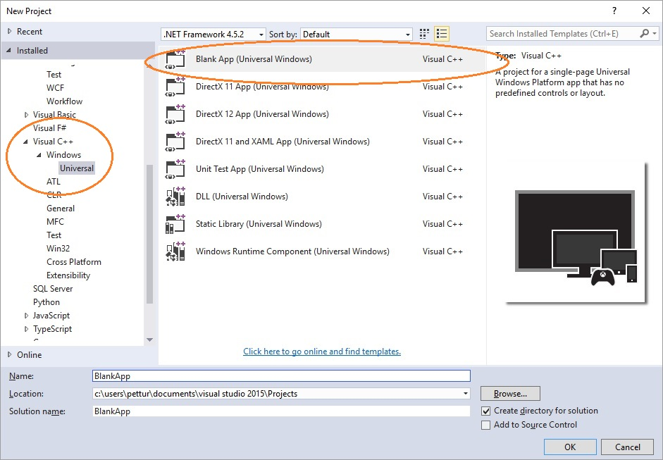
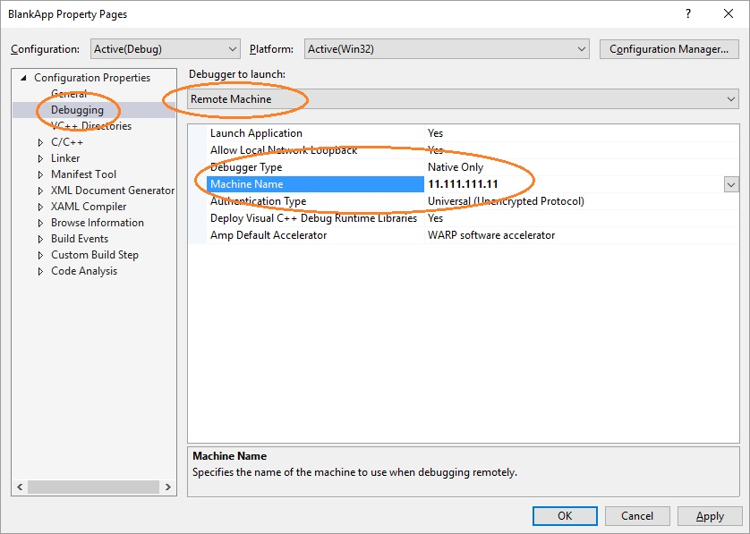

# Configurar el entorno de desarrollo de UWP en Xbox

El entorno de desarrollo de la Plataforma universal de Windows (UWP) en Xbox consta de un equipo de desarrollo conectado a una consola Xbox One a través de una red local.
El equipo de desarrollo requiere Windows 10, Visual Studio 2015 Update 2, la compilación 14295 de la versión preliminar del SDK de Windows 10 y una amplia variedad de herramientas de soporte.

En este artículo se describen los pasos para configurar y probar el entorno de desarrollo.

## Instalación de Visual Studio

1. Instala Visual Studio 2015 Update 2 o una versión posterior. Para obtener más información, consulta [Descargas y herramientas para Windows 10](https://dev.windows.com/downloads).

1. Al instalar Visual Studio 2015 Update 2, asegúrate de seleccionar la casilla **Herramientas de desarrollo de aplicaciones universales de Windows**.

  

## Configuración del SDK de Windows 10

Instala la versión preliminar del SDK de Windows 10 más reciente. Para obtener información sobre la instalación, consulta [Descarga las actualizaciones para desarrolladores de Insider Preview](http://go.microsoft.com/fwlink/p/?LinkId=780552).

  > **Importante**
            &nbsp;&nbsp;Debes instalar el SDK más reciente, pero _no_ necesitas instalar la última versión de Windows Insider Preview del sistema operativo.

## Configuración de la consola Xbox One

Para poder implementar una aplicación en tu Xbox One, un usuario debe haber iniciado sesión en la consola. Puedes usar tu cuenta de Xbox Live existente o crear una nueva cuenta para la consola en el modo de desarrollador. 

## Crear tu primera aplicación

1. Asegúrate de que el equipo de desarrollo esté en la misma red local que la consola Xbox One de destino. Por lo general, esto significa que deben usar el mismo enrutador y estar en la misma subred. Se recomienda una conexión de red con cable.

1. Asegúrate de que la consola Xbox One esté en el modo de desarrollador.  Para obtener más información, consulta [Enabling developer mode on Xbox One (Habilitar el modo de desarrollador en Xbox One)](devkit-activation.md).

1. Decide el lenguaje de programación que quieres usar para la aplicación para UWP.

1. En el equipo de desarrollo, selecciona **Nuevo proyecto** y, a continuación, selecciona **Windows/Universal/Aplicación vacía**.

### Iniciar un proyecto C#

  

1. Selecciona las opciones predeterminadas en el cuadro de diálogo **Nuevo proyecto de Windows universal**. Si se muestra el cuadro de diálogo **Modo de desarrollador**, haz clic en **Aceptar**. Se crea una nueva aplicación vacía.

1. Configura el entorno de desarrollo para la depuración remota:

  1. Haz clic con el botón derecho en el proyecto y luego selecciona **Propiedades**.
  1. En la pestaña **Depurar** , cambia **Dispositivo de destino** por **Máquina remota**.
  1. En **Máquina remota**, escribe la dirección IP del sistema o el nombre de host de la consola Xbox One. Para obtener información acerca de cómo obtener la dirección IP o el nombre de host, consulta [Introduction to Xbox One tools (Introducción a las herramientas de Xbox One)](introduction-to-xbox-tools.md).
  1. En la lista desplegable **Modo de autenticación**, selecciona **Universal (protocolo sin cifrar)**.

    

### Iniciar un proyecto C++

  

1. Selecciona las opciones predeterminadas en el cuadro de diálogo **Nuevo proyecto de Windows universal**. Si se muestra el cuadro de diálogo **Modo de desarrollador**, haz clic en **Aceptar**. Se crea una nueva aplicación vacía.

1. Configura el entorno de desarrollo para la depuración remota:

   1. Haz clic con el botón derecho en el proyecto y luego selecciona **Propiedades**.
   1. En la pestaña **Depuración** , cambia **Depurador para iniciar** por **Máquina remota**.
   1. En **Nombre de máquina**, escribe la dirección IP del sistema o el nombre de host de la consola Xbox One. Para obtener información acerca de cómo obtener la dirección IP o el nombre de host, consulta [Introduction to Xbox One tools (Introducción a las herramientas de Xbox One)](introduction-to-xbox-tools.md).
   1. En la lista desplegable **Tipo de autenticación**, selecciona **Universal (protocolo sin cifrar)**.

    

### Emparejar mediante PIN el dispositivo con Visual Studio

1. Guarda la configuración y asegúrate de que la consola Xbox One esté en modo de desarrollador.

1. Presiona F5.

1. Si es la primera implementación, obtendrás un cuadro de diálogo de Visual Studio que te solicitará que emparejes el dispositivo mediante PIN.

  1. Para obtener un PIN, abre **Dev Home** desde la pantalla de inicio en la consola Xbox One.
  1. Selecciona **Emparejar con Visual Studio**.

    

  1. Introduce el PIN en el cuadro de diálogo **Pair with Visual Studio**. El PIN siguiente es solo un ejemplo; el tuyo será diferente.

    

  1. Los errores de implementación, si los hay, aparecerán en la ventana **Resultados**.

Enhorabuena, has creado e implementado tu primera aplicación para UWP en Xbox correctamente.

## Consulta también
- [Enabling Developer Mode on Xbox One (Habilitar el modo de desarrollador en Xbox One)](devkit-activation.md)  
- [Descargas y herramientas para Windows 10](https://dev.windows.com/downloads)  
- [Descarga las actualizaciones para desarrolladores de Insider Preview](http://go.microsoft.com/fwlink/?LinkId=780552)  
- [Introduction to Xbox One tools (Introducción a las herramientas de Xbox One)](introduction-to-xbox-tools.md) 
- [UWP on Xbox One (UWP en Xbox One)](index.md)

----

<!--HONumber=Jun16_HO5-->

