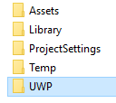

# Unity: Control de versiones del proyecto para UWP

¿Todavía no has compilado tu juego Unity para Xbox con la Plataforma universal de Windows (UWP)?  Como primer paso, consulta el documento [Llevar los juegos Unity a UWP en Xbox](development-lanes-unity.md).

Existen diferentes motivos por los que quisieras agregar partes de tu directorio de UWP generado al control de versiones, una de ellas es agregar dependencias (por ejemplo, el SDK de Xbox Live).  Usaremos este escenario como ejemplo para este tutorial y esperamos que te sirva de ayuda para resolver las necesidades individuales de tu proyecto.

***Declinación de responsabilidades: Usaremos Git como nuestra solución de control de versiones.  Aunque uses una solución distinta, los conceptos deberían poder aplicarse.***

Para refrescarte la memoria, este es el aspecto actual del directorio de nuestro juego, ***ScrapyardPhoenix***:

Y este es el aspecto de nuestro directorio para UWP:

En este directorio, lo único que nos interesa es una carpeta, la carpeta ***ScrapyardPhoenix*** (inserta el nombre de tu juego aquí).  En nuestro control de versiones, todo lo demás puede omitirse.

***¿No sabes lo que es un archivo .gitignore?  Consulta [gitignore](https://git-scm.com/docs/gitignore).***

    ##################################################################
    # The original .gitignore file can be found at
    # https://github.com/github/gitignore/blob/master/Unity.gitignore
    ##################################################################

    # standard ignores for a Unity Project
    ...

    # ignore the whole UWP directory
    /UWP/**

    # except we want to keep... (this line will be modified and removed further down)
    !/UWP/ScrapyardPhoenix/

Vamos a seleccionar unos cuantos archivos y carpetas diferentes de la carpeta **UWP/ScrapyardPhoenix** para agregarlos a nuestro control de versiones.  En primer lugar, echemos un vistazo general en detalle:

  

## Carpetas  

`Assets` | ***Incluir*** | Contiene imágenes de Microsoft Store  
`Data`   | ***Omitir*** | Donde Unity compila el proyecto (escenas, sombreadores, Scripts, Prefabs, etcetera.)  
`Dependencies` | ***Incluir*** | Esta carpeta es que he creado para mantener todas las dependencias UWP en (por ejemplo, XboxLiveSDK.dll)  
`Properties` | ***Incluir*** | Contiene la configuración más avanzada que se puede modificar el desarrollador  
`Unprocessed` | ***Omitir*** | Contiene Unity `.dll` y `.pdb` archivos  

## Archivos  

`App.cs` | ***Incluir*** | Punto de entrada de la aplicación para UWP. se puede modificar y ampliar con otros archivos de origen  
`Package.appxmanifest` | ***Incluir*** | Archivo de manifiesto de paquete de aplicación para tu AppX  
`project.json` | ***Incluir*** | Describe los paquetes de NuGet tu `*.csproj` depende  
`ScrapyardPhoenix.csproj` | ***Incluir*** | Describe el destino de compilación para UWP; Si agregas dependencias adicionales a tu UWP proyecto, este `*.csproj` archivo contendrá dicha información  
`ScrapyardPhoenix.csproj.user` | ***Omitir*** | Este archivo contiene información de usuario local

## Archivo .gitignore resultante

    ##################################################################
    # The original .gitignore file can be found at
    # https://github.com/github/gitignore/blob/master/Unity.gitignore
    ##################################################################

    # standard ignores for a Unity Project
    ...

    # ignore the whole UWP directory
    /UWP/**

    # except we want to keep...
    !/UWP/ScrapyardPhoenix/Assets/*
    !/UWP/ScrapyardPhoenix/Dependencies/*
    !/UWP/ScrapyardPhoenix/Properties/*
    !/UWP/ScrapyardPhoenix/App.cs
    !/UWP/ScrapyardPhoenix/Package.appxmanifest
    !/UWP/ScrapyardPhoenix/project.json
    !/UWP/ScrapyardPhoenix/ScrapyardPhoenix.csproj

Y ya está; ahora tus compañeros de equipo estarán sincronizados con el proyecto para UWP que has generado. Ahora puedes agregar activos adicionales, código fuente y dependencias al proyecto UWP.

Puedes encontrarse algunos otros ejemplos de control de versiones de la carpeta UWP en [estos ejemplos](https://bitbucket.org/Unity-Technologies/windowsstoreappssamples/overview).

## Agregar dependencias a tu aplicación para UWP

Para agregar dependencias a archivos DLL y WINMD, colócalos en la carpeta **Assets** (Activos) de Unity en la carpeta **Plugins** (Complementos), luego selecciónalos y establece su configuración de plataforma de destino adecuadamente en el Inspector.

***ScrapyardPhoenix (Universal Windows)*** es el proyecto al que agregarías una referencia, por ejemplo, el SDK de Xbox Live.

## Consulta también
- [Llevar los juegos existentes a Xbox](development-lanes-landing.md)
- [UWP en Xbox One](index.md)
