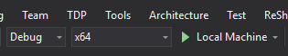

# Llevar los juegos Unity a UWP en Xbox

En este tutorial paso a paso, suponemos que ya tienes un juego en Unity listo para compilar e implementar.

Consulta también una [versión en vídeo de este tutorial](https://www.youtube.com/watch?v=f0Ptvw7k-CE).

¿Quieres versionar el proyecto para UWP de Unity? Consulta [Control de versiones del proyecto para UWP](development-lanes-unity-versioning.md).

## Paso 0: Asegurarte de que Unity esté instalado correctamente

Al instalar Unity, deben seleccionarse los siguientes componentes:

## Paso 1: Compilar la solución para UWP

En el proyecto de juego de Unity, abre la ventana **Build Settings** (Configuración de compilación) que se encuentra en **File -> Build Settings** (Archivo -> Configuración de compilación) y ve al menú de opciones de Microsoft Store.

Asegúrate de que la opción **SDK** esté establecida en **Universal 10** y luego selecciona el botón **Build** (Compilar), que iniciará una ventana de Explorador de archivos y solicitará una carpeta de destino. Crea una carpeta denominada **UWP** junto al directorio **Assets** (Activos) del proyecto y elige esta carpeta como carpeta de destino de la compilación.

Unity ha creado una nueva solución de Visual Studio que usaremos para implementar el juego para UWP.

## Paso 2: Implementar el juego

Abre la solución recién generada en la carpeta **UWP** y cambia la plataforma de destino a **x64**.

Ahora que tienes una solución de Visual Studio para UWP para tu juego, [si sigues estos pasos](getting-started.md), podrás implementar correctamente el juego en tu Xbox One comercial.

## Paso 3: Modificar y recompilar

Si se realizan cambios en cualquier elemento que no sea un script, es necesario recompilar el proyecto en el Editor (como se describe en el __Paso 1__) para que dichos cambios se muestren en la compilación para UWP del juego.

## Control de versiones del proyecto para UWP

Existen unas pocas situaciones comunes en las que es necesario agregar partes de este directorio de UWP recién generado al control de versiones. Por ejemplo, si agregas una nueva dependencia al proyecto de UWP (como el SDK de Xbox Live).  Examinaremos este ejemplo en detalle en [Control de versiones del proyecto para UWP](development-lanes-unity-versioning.md).

## Consulta también
- [Llevar los juegos existentes a Xbox](development-lanes-landing.md)
- [UWP en Xbox One](index.md)
