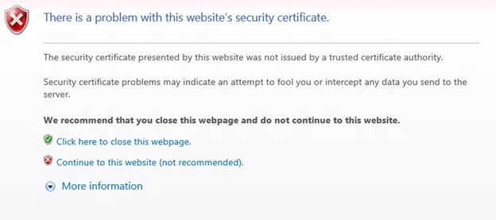

# Problemas conocidos de UWP en Xbox One Developer Preview.

La actualización del sistema de Xbox Developer Preview incluye software experimental y de versión preliminar. 
Esto significa que algunos juegos y aplicaciones conocidos no funcionan según lo esperado y es posible que experimentes bloqueos y pérdidas de datos ocasionales. 
Si sales de la versión preliminar para desarrolladores, la consola restablecerá la configuración de fábrica y tendrás que volver a instalar todos los juegos, las aplicaciones y el contenido.

Para los desarrolladores, esto significa que no todas las API y las herramientas de desarrollo funcionan según lo esperado. 
También quiere decir que no todas las características destinadas a la versión final están incluidas o que estas no tienen la calidad de la versión final. 
**En concreto, significa que el rendimiento del sistema de esta versión preliminar no refleja el rendimiento del sistema de la versión final.**

La siguiente lista destaca algunos problemas conocidos que pueden aparecer en esta versión, aunque no es una lista exhaustiva. 

**Queremos que recibir tus comentarios**, de modo que informa sobre todos los problemas que encuentres en el foro [Desarrollo de aplicaciones universales de Windows](https://social.msdn.microsoft.com/Forums/windowsapps/en-US/home?forum=wpdevelop) . 

Si te quedas atascado, busca aquí y en [Preguntas más frecuentes](frequently-asked-questions.md); también puedes usar el foro para pedir ayuda.

## Desarrollo de juegos

### x86 frente a x64

Para el momento en que publiquemos la versión más adelante este año, tendremos una gran compatibilidad con los sistemas basados en x86 y x64 bits, además, esta versión preliminar admite x86 bits. 
Sin embargo, la arquitectura de x64 bits se ha probado muchas más veces hasta la fecha (el Shell de Xbox y todas las aplicaciones que se ejecutan actualmente en la consola son de x64 bits), por lo tanto, te recomendamos que uses esta para los proyectos. 
En especial para los juegos.

Si decide usar la arquitectura de x86 bits, infórmanos de cualquier problemas que veas en el foro.

Consulta también la sección [Cambiar los modos de compilación puede producir errores de implementación](known-issues.md#switching-build-flavors-can-cause-deployment-failures) más adelante en esta página.

### Motores de juegos

Hemos probado algunos motores de juegos populares, pero no todos; asimismo, la cobertura de prueba para esta versión preliminar no ha sido completa. 
Puede que tu experiencia sea diferente. 
Nos encantaría recibir tus comentarios al respecto. 
Usa el foro para notificar los problemas que encuentres.

### Compatibilidad con DirectX 12

UWP en Xbox One admite el nivel de característica 10 de DirectX 11. 
De momento no se admite DirectX 12. 
Xbox One, al igual que todas las consolas de juegos tradicionales, es una herramienta de hardware especializada que requiere un SDK específico para alcanzar su potencial máximo. 
Si estás trabajando en un juego que requiere acceso al máximo potencial del hardware Xbox One, puedes registrarte con el programa [ID@XBOX](http://www.xbox.com/en-us/Developers/id) para obtener acceso a ese SDK, que incluye compatibilidad con DirectX 12.

## Recursos del sistema de aplicaciones para UWP y juegos en Xbox One

Las aplicaciones para UWP y los juegos que se ejecutan en Xbox One comparten recursos con el sistema y otras aplicaciones, de modo que el sistema controla los recursos que están disponibles para cualquier juego o aplicación. 
Si tienes problemas de memoria o rendimiento, este podría ser el motivo. 
Para obtener más información, consulta [Recursos del sistema de aplicaciones para UWP y juegos en Xbox One](system-resource-allocation.md).

## Uso de sockets tradicionales de redes

En esta versión preliminar para desarrolladores, el acceso de redes entrantes y salientes desde la consola que usa los sockets TCP o UDP tradicionales (WinSock, Windows.Networking.Sockets) no está disponible. 
Los desarrolladores pueden usar HTTP y WebSockets. 

## Cobertura de API de UWP

No todas las API de UWP funcionan según lo previsto en Xbox en esta versión preliminar. 
Consulta [Limitaciones del área de características de la familia de dispositivos de UWP en Xbox](http://go.microsoft.com/fwlink/p/?LinkId=760755) para obtener la lista de las API que sabemos que no funcionan. 
Si encuentras problemas con otras API, notifícalo en los foros. 

## Los controles XAML no se parecen ni se comportan como los controles en el Shell de Xbox One

En esta versión preliminar para desarrolladores, los controles XAML no están en su forma final. En particular:
* La navegación X-Y del controlador para juegos no funciona de manera fiable para todos los controles.
* Los controles no se parecen a los controles del Shell de Xbox. Esto incluye el rectángulo de foco de control.
* La navegación entre controles no emite "sonidos de navegación" de manera automática.

Estos problemas se resolverán en una futura versión preliminar para desarrolladores.

## Problemas de Visual Studio e implementación

### Cambiar los modos de compilación, lo que puede producir errores de implementación

Cambiar entre compilaciones de depuración y de lanzamiento, entre las arquitecturas x86 y x64 o entre compilaciones administradas y de .NET nativas, puede provocar errores de implementación. 

La forma más sencilla para evitar estos problemas en esta versión preliminar es mantenerse en la compilación de depuración y en una arquitectura. 

Si experimentas este problema, lo habitual es que se resuelva si desinstalas la aplicación de la aplicación Colecciones en Xbox One.

> **Nota**&nbsp;&nbsp;Desinstalar la aplicación Windows Device Portal (WDP) no resolverá el problema.

Si los problemas persisten, desinstala la aplicación o el juego de la aplicación Colecciones, sal del modo de desarrollador, reinicia el modo comercial y vuelve al modo de desarrollador.

Para obtener más información, consulta la sección "Solucionar errores de implementación" en [Preguntas más frecuentes](frequently-asked-questions.md).

### Desinstalar una aplicación durante la depuración en Visual Studio provoca un error de forma silenciosa

Intentar desinstalar una aplicación que se está ejecutando en el depurador a través de la herramienta "Aplicaciones instaladas" de WDP " provoca un error de forma silenciosa. 
La solución es detener la depuración de la aplicación en Visual Studio antes de intentar quitarla mediante WDP.

### Errores de emparejamiento de PIN de Visual Studio y Xbox

Es posible que se alcance un estado donde el emparejamiento de PIN entre Visual Studio y Xbox One se desincronice. 
Si se produce un error de emparejamiento de PIN, usa el botón "Quitar todos los emparejamientos" en Dev Home, reinicia Xbox One, reinicia el equipo de desarrollo y, a continuación, vuelve a intentarlo. 

## Vista previa de Windows Device Portal (WDP)

### Iniciar WDP desde Dev Home bloquea Dev Home

Si inicias WDP en Dev Home, este último se bloqueará después de que hayas escrito el nombre de usuario y contraseña y hayas hecho clic en **Guardar**. 
Las credenciales se guardan pero WDP no se inicia. 
Puedes iniciar WDP si reinicias Xbox One. 

### No funciona la deshabilitación de WDP en Dev Home

Si deshabilitas WDP en Dev Home, se desactivará. 
Sin embargo, cuando reinicies Xbox One, WDP se volverá a iniciar. 
Puedes evitar este problema si usas **Restablecer y mantener mis juegos y aplicaciones** para eliminar cualquier estado almacenado en Xbox One. 
Ve a Configuración > Sistema > Información y actualizaciones de consola > Restablecer consola y, a continuación, selecciona el botón **Restablecer y mantener mis juegos y aplicaciones**.

> **Precaución**&nbsp;&nbsp;Esto eliminará todos la configuración guardada en Xbox One incluidas la configuración inalámbrica, las cuentas de usuario y cualquier progreso de los juegos que no se haya guardado en la nube.

> **Precaución**&nbsp;&nbsp;NO seleccione el botón **Restablecer y quitar todo**.
Esto eliminará todos los juegos, las aplicaciones, la configuración y el contenido; desactivará el modo de desarrollador y quitará la consola del grupo de la versión preliminar para desarrolladores.

### Las columnas de la tabla "Aplicaciones en ejecución" no se actualizan de manera predictiva. 

En ocasiones, esto se resuelve ordenando una columna en la tabla.

### La interfaz de usuario de WDP no se muestra correctamente en Internet Explorer 11 

De manera predeterminada, la interfaz de usuario de WDP no se muestren correctamente en el explorador cuando se usa Internet Explorer 11. 
Para solucionar este problema, desactiva la Vista de compatibilidad de Internet Explorer 11 para WDP.

### Desplazarse a WDP genera una advertencia de certificado

Recibirás una advertencia acerca del certificado proporcionado, similar a la siguiente captura de pantalla, 
porque el certificado de seguridad firmado por la consola Xbox One no se considera un editor de confianza conocido. 
Haz clic en "Continuar a este sitio web" para acceder a Windows Device Portal.

## Dev Home
En ocasiones, seleccionar la opción "Administrar Windows Device Portal" en Dev Home provocará que este último salga de forma silenciosa a la pantalla Inicio. 
Esto se debe a un error en la infraestructura WDP de la consola y se puede resolver reiniciando la consola.

## Consulta también
- [Preguntas más frecuentes](frequently-asked-questions.md)
- [UWP en Xbox One](index.md)

<!--HONumber=Mar16_HO5-->

